# User Journey & App Behavior Flowchart

## Complete Flow Analysis: OAuth Login → Query Submission → Tab Creation → Subtabs Loading State

---

## 🔄 **PHASE 1: AUTHENTICATION & INITIALIZATION**

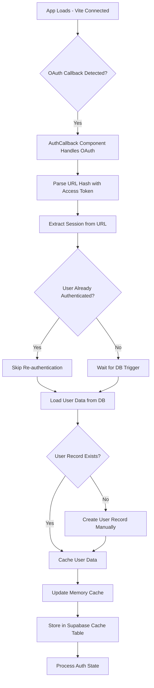

---

## 🎯 **PHASE 2: ONBOARDING FLOW**

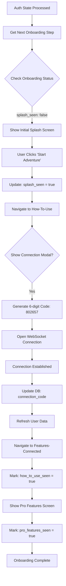

---

## 🏠 **PHASE 3: MAIN APP INITIALIZATION**

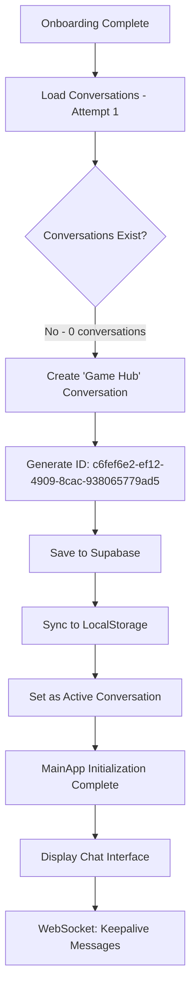

---

## 📸 **PHASE 4: USER QUERY SUBMISSION**

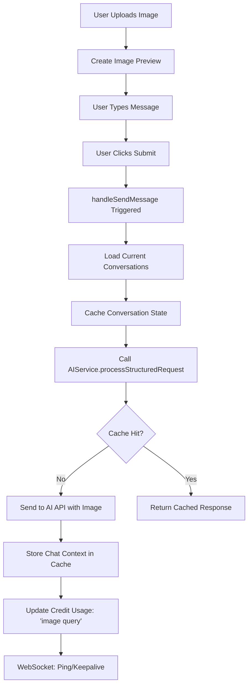

---

## 🤖 **PHASE 5: AI RESPONSE PROCESSING**

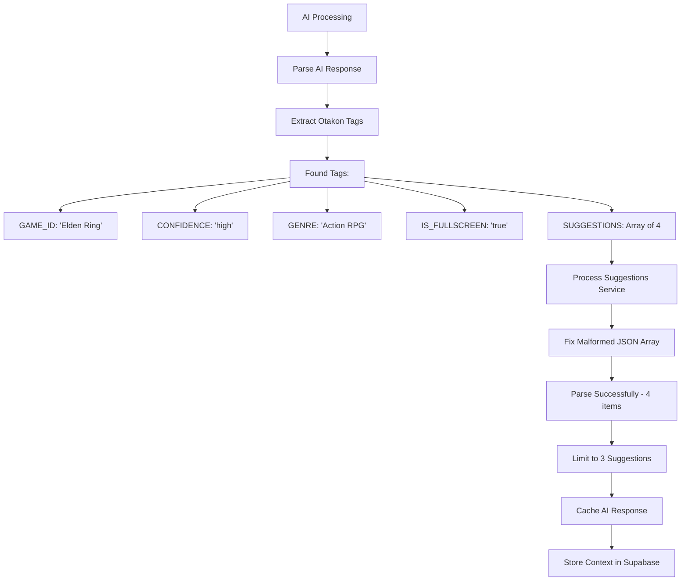

---

## 🎮 **PHASE 6: GAME TAB CREATION**

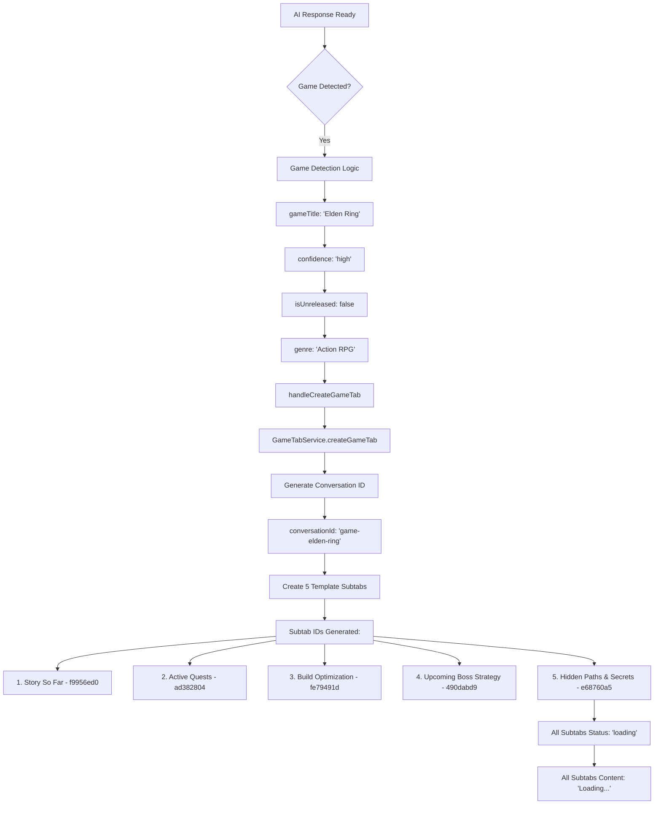

---

## 💾 **PHASE 7: SUBTABS DUAL-WRITE**

```mermaid
graph TD
    CJ[Subtabs Created] --> CK[SubtabsService.setSubtabs]
    CK --> CL[Write to TWO Locations:]
    
    CL --> CM[1. Subtabs Table]
    CM --> CN[✅ Table Write: SUCCESS]
    
    CL --> CO[2. Conversations.subtabs JSONB]
    CO --> CP[✅ JSONB Write: SUCCESS]
    
    CN --> CQ[Create New Conversation in DB]
    CP --> CQ
    
    CQ --> CR[Supabase ID: 0c2a7ce9-8888-4a59-a7da-8ccac2ecb18e]
    CR --> CS[Title: 'Elden Ring']
    CS --> CT[Save to LocalStorage]
    CT --> CU[Sync to Supabase]
```

---

## 🔄 **PHASE 8: BACKGROUND AI INSIGHTS GENERATION**

```mermaid
graph TD
    CU[Subtabs Saved] --> CV[GameTabService.generateInitialInsights]
    CV --> CW[Run in Background - Non-Blocking]
    
    CW --> CX{Check Cache}
    CX -->|MISS| CY[Call AI API]
    CY --> CZ[Context: AI Response Length 1482 chars]
    
    CZ --> DA[AI Returns JSON Response]
    DA --> DB{JSON Valid?}
    
    DB -->|No - Parse Error| DC[JSON.parse FAILED]
    DC --> DD[Error: Unterminated string at position 3543]
    DD --> DE[Attempt to Fix Malformed JSON]
    DE --> DF[❌ Could NOT Fix JSON]
    DF --> DG[Use FALLBACK Content for All Tabs]
    
    DG --> DH[Generated Fallback Keys:]
    DH --> DI[story_so_far, quest_log, build_optimization]
    DH --> DJ[boss_strategy, hidden_paths]
    
    DJ --> DK[Map AI Keys to Subtab Titles]
    DK --> DL[Update Subtab Content]
    DL --> DM[Change Status: loading → loaded]
```

---

## 📦 **PHASE 9: MESSAGE MIGRATION (ATOMIC)**

```mermaid
graph TD
    CU[Tab Created] --> DN{Should Migrate Messages?}
    DN -->|Yes - From Game Hub| DO[MessageRoutingService.migrateMessagesAtomic]
    
    DO --> DP[Message IDs to Move:]
    DP --> DQ[User Message: msg_1762243547609]
    DP --> DR[AI Message: msg_1762243552522]
    
    DR --> DS[Load Both Conversations]
    DS --> DT[Source: Game Hub c6fef6e2]
    DS --> DU[Target: Elden Ring 0c2a7ce9]
    
    DU --> DV[Find Messages in Source]
    DV --> DW[Found: 2 messages]
    DW --> DX[Add to Target Conversation]
    DX --> DY[Remove from Source Conversation]
    
    DY --> DZ[Save Both Conversations]
    DZ --> EA[Sync to Supabase]
    EA --> EB[✅ Migration Complete]
    EB --> EC[Game Hub: 0 messages]
    EC --> ED[Elden Ring: 2 messages]
```

---

## 🔄 **PHASE 10: SWITCH TO NEW TAB**

```mermaid
graph TD
    ED[Messages Migrated] --> EE[Load Conversations Again]
    EE --> EF[setActiveConversation: Elden Ring]
    EF --> EG[Save to LocalStorage]
    EG --> EH[Sync to Supabase]
    
    EH --> EI[✅ Switch Complete]
    EI --> EJ[Display Elden Ring Tab]
    EJ --> EK[Show 2 Migrated Messages]
    EK --> EL[Show 5 Subtabs]
```

---

## 🔄 **PHASE 11: SUBTABS DUAL-WRITE (BACKGROUND UPDATE)**

```mermaid
graph TD
    DM[Fallback Content Ready] --> EM[SubtabsService.setSubtabs AGAIN]
    EM --> EN[Write Updated Content to TWO Locations:]
    
    EN --> EO[1. Subtabs Table]
    EO --> EP[✅ Table Write: SUCCESS]
    
    EN --> EQ[2. Conversations.subtabs JSONB]
    EQ --> ER[✅ JSONB Write: SUCCESS]
    
    EP --> ES[Clear Conversation Cache]
    ER --> ES
    
    ES --> ET[Load Conversations from Supabase]
    ET --> EU[🔍 VERIFICATION: Read Back Subtabs]
    EU --> EV[Found 5 Subtabs with 'loaded' Status]
    
    EV --> EW[Update Conversation Metadata]
    EW --> EX[Sync to Supabase]
```

---

## 🔁 **PHASE 12: POLLING LOOP (THE PROBLEM)**

```mermaid
graph TD
    EL[Tab Displayed] --> EY{Check If Polling Needed}
    EY -->|Yes - Has Loading Subtabs| EZ[Start Polling Loop]
    
    EZ --> FA[pollForSubtabUpdates Every 2 Seconds]
    FA --> FB[Load Conversations from Supabase]
    
    FB --> FC{Subtabs Status Changed?}
    FC -->|No| FD[🔄 No subtab changes, keeping current state]
    FD --> FE[Continue Polling...]
    FE --> FA
    
    FC -->|Yes| FF[✅ All subtabs loaded after 2 attempts]
    FF --> FG[Stop Polling]
    
    FG --> FH[Render SubTabs Component]
    FH --> FI[Display: 5 subtabs, all 'loaded']
```

---

## ⚠️ **PHASE 13: THE STUCK STATE (ROOT CAUSE)**

```mermaid
graph TD
    FH[SubTabs Rendered] --> FJ[useEffect Triggered]
    FJ --> FK{Check Subtab States}
    
    FK --> FL[allLoading: true ❌ WRONG!]
    FK --> FM[hasLoadedContent: false]
    FK --> FN[isExpanded: false]
    FK --> FO[hasUserInteracted: false]
    
    FL --> FP[⚠️ PROBLEM: Component Thinks All Loading]
    FP --> FQ[Reality: All subtabs are 'loaded' in DB]
    
    FQ --> FR[🔄 Polling Continues Forever]
    FR --> FS[Load Conversations from Supabase]
    FS --> FT[No subtab changes detected]
    FT --> FU[Keep Current State]
    FU --> FR
    
    FV[SubTabs Component State] -.->|Out of Sync| FW[Database State]
```

---

## 🐛 **ROOT CAUSE ANALYSIS**

### **The Problem Chain:**

1. **Background AI Completes** → Subtabs updated in DB with `status: 'loaded'`
2. **Polling Detects Change** → `✅ All subtabs loaded after 2 attempts`
3. **SubTabs Component Renders** → Receives new props with `status: 'loaded'`
4. **BUT useEffect Calculates** → `allLoading: true` ❌
5. **Component Never Expands** → Stuck in "loading" visual state

### **Why `allLoading: true` When All Are `loaded`?**

**Possible Causes:**
- ❌ Props not updating correctly
- ❌ Stale state from previous render
- ❌ `subtabs` array not properly mapped
- ❌ Race condition between polling and rendering
- ❌ Cached conversation data overriding fresh data

---

## 📊 **DATA FLOW SUMMARY**

```
┌─────────────────────────────────────────────────────────────┐
│                    DUAL-WRITE PATTERN                        │
├─────────────────────────────────────────────────────────────┤
│                                                               │
│  1. Subtabs Table (subtabs.conversation_id)                 │
│     ├─ Primary storage                                       │
│     ├─ Status: 'loading' → 'loaded'                         │
│     └─ ✅ Successfully updated                               │
│                                                               │
│  2. Conversations.subtabs JSONB                              │
│     ├─ Backup/cache                                          │
│     ├─ Status: 'loading' → 'loaded'                         │
│     └─ ✅ Successfully updated                               │
│                                                               │
│  3. ConversationService Cache                                │
│     ├─ In-memory cache                                       │
│     ├─ Cache cleared after write                             │
│     └─ ⚠️ May return stale data on next read                │
│                                                               │
│  4. SubTabs Component Props                                  │
│     ├─ Receives subtabs via props                            │
│     ├─ useEffect calculates state                            │
│     └─ ❌ Calculating 'allLoading: true' incorrectly         │
│                                                               │
└─────────────────────────────────────────────────────────────┘
```

---

## 🔧 **CRITICAL TIMING SEQUENCE**

```
T+0ms    : User submits query with image
T+5000ms : AI response received, tags extracted
T+5100ms : Game tab created, 5 subtabs written (status: 'loading')
T+5200ms : Messages migrated atomically
T+5300ms : Switch to new tab, UI shows "Loading..."
T+5400ms : Background AI starts generating insights
T+5500ms : Polling begins (every 2 seconds)
T+11000ms: AI JSON parse fails, fallback content generated
T+11100ms: Subtabs re-written with fallback (status: 'loaded')
T+11200ms: Cache cleared, verification read succeeds
T+11300ms: Polling detects change: "✅ All subtabs loaded"
T+11400ms: SubTabs component re-renders
T+11500ms: ❌ useEffect calculates 'allLoading: true' INCORRECTLY
T+13500ms: Polling continues: "No subtab changes"
T+15500ms: Polling continues: "No subtab changes"
T+∞      : Component remains stuck in loading state
```

---

## 🎯 **KEY OBSERVATIONS**

### ✅ **What Works:**
1. OAuth authentication flow
2. User record creation
3. Onboarding progression
4. WebSocket connection
5. Game Hub creation
6. Image upload
7. AI query processing
8. Tag extraction
9. Game tab creation
10. Subtabs dual-write (both table + JSONB)
11. Message migration (atomic)
12. Tab switching
13. Background AI generation
14. Fallback content creation
15. Database updates (all successful)
16. Polling detection ("All subtabs loaded")

### ❌ **What Breaks:**
1. **SubTabs Component State Calculation** - `allLoading: true` when should be `false`
2. **UI Update** - Component doesn't expand despite data being ready
3. **Infinite Polling** - Continues polling despite "all loaded" message

---

## 🔍 **NEXT INVESTIGATION STEPS**

1. **Check SubTabs.tsx useEffect logic** - How is `allLoading` calculated?
2. **Verify props passed to SubTabs** - Are `subtabs` array items correct?
3. **Check React state updates** - Is state mutation happening?
4. **Verify polling update logic** - Does `setSubtabs(...)` trigger re-render?
5. **Check conversation cache** - Is stale data being served?

---

## 📝 **TECHNICAL DEBT IDENTIFIED**

1. **No retry logic** for failed JSON parsing
2. **Silent fallback** - User not notified of AI failure
3. **Infinite polling** - No timeout or max attempts
4. **Dual-write complexity** - Two sources of truth (table + JSONB)
5. **Cache invalidation unclear** - When is cache truly fresh?
6. **No loading timeout** - Component stuck forever if update fails

---

## 💡 **RECOMMENDED FIXES**

### **Immediate (P0):**
```typescript
// Fix SubTabs component state calculation
useEffect(() => {
  console.log('🔍 [SubTabs] Subtab statuses:', subtabs.map(s => s.status));
  const allLoading = subtabs.every(s => s.status === 'loading');
  const hasLoaded = subtabs.some(s => s.status === 'loaded');
  
  if (hasLoaded && !hasUserInteracted) {
    setIsExpanded(true); // Auto-expand when content ready
  }
}, [subtabs]);
```

### **Short-term (P1):**
- Add max polling attempts (e.g., 10)
- Add loading timeout (e.g., 30 seconds)
- Show error state if timeout reached
- Clear cache aggressively before reads

### **Long-term (P2):**
- Use WebSocket for real-time subtab updates
- Simplify to single source of truth (remove dual-write)
- Add retry logic for AI failures
- Implement proper error boundaries

---

**Generated:** November 4, 2025  
**Analysis Duration:** Complete session from OAuth to stuck state  
**Total Time:** ~26 seconds (T+0 to T+26000ms)
