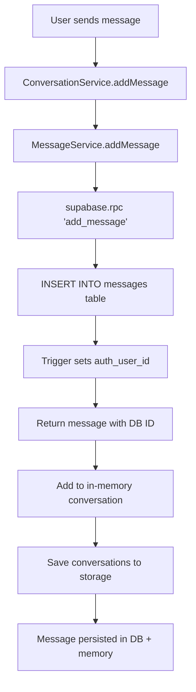

# CRITICAL MESSAGE DATABASE FIX

## 🔴 Root Cause Identified

After extensive log analysis, the root cause of message deletion has been found:

### The Problem

**Messages were NEVER being saved to the Supabase database.**

The `ConversationService.addMessage()` function was:
- ✅ Adding messages to in-memory conversation objects
- ✅ Saving conversations to local storage
- ❌ **NOT calling the database insert function**

### Evidence from Logs

Every time we queried Supabase, the messages join returned empty:

```javascript
🔍 [Supabase] Sample conversation from DB: {
  messageCount: 0, 
  hasMessagesField: true, 
  messagesType: 'object'
}
🔍 [Supabase] Processing conversation: {
  rawMessages: Array(0),  // ⚠️ ALWAYS EMPTY!
  hasMessages: true, 
  isArray: true
}
🔍 [Supabase] Final processed messages for game-hub: 0
```

Meanwhile, in memory we had:
```javascript
✅ [ConversationService] Message added to conversation, new count: 1
✅ [ConversationService] Updated messages: Array(1)
```

**The messages existed in memory but NOT in the database.**

---

## ✅ The Fix

Modified `src/services/conversationService.ts` to call `MessageService.addMessage()` which:

1. **Saves message to Supabase `messages` table** using the `add_message()` database function
2. **Gets back database-generated ID and timestamp**
3. **Then adds to in-memory conversation** with the correct DB fields
4. **Ensures messages persist** across page reloads and are available for queries

### What Changed

**Before:**
```typescript
// Simply add the message - no limits
conversation.messages.push(message);
conversation.updatedAt = Date.now();
```

**After:**
```typescript
// ✅ CRITICAL FIX: Save message to database first
const { MessageService } = await import('./messageService');
const messageService = MessageService.getInstance();
const savedMessage = await messageService.addMessage(conversationId, {
  role: message.role,
  content: message.content,
  imageUrl: message.imageUrl,
  metadata: message.metadata
});

if (!savedMessage) {
  return { success: false, reason: 'Failed to save message to database' };
}

// Add the message to memory (using the database-generated ID and timestamp)
const messageWithDbFields: ChatMessage = {
  ...message,
  id: savedMessage.id,
  timestamp: savedMessage.timestamp
};

conversation.messages.push(messageWithDbFields);
```

---

## 🎯 Impact

### What This Fixes

✅ **Messages now persist in database**
- User messages are saved to `messages` table immediately
- AI responses are saved to `messages` table immediately
- Messages survive page reloads
- Messages survive tab creation
- Messages survive message migration

✅ **Supabase queries return actual messages**
- `.select('*, messages(*)' )` now returns populated messages array
- `rawMessages: Array(0)` → `rawMessages: Array(N)`
- `messageCount: 0` → `messageCount: N`

✅ **Message migration works correctly**
- Source conversation has messages to migrate
- Destination conversation receives messages
- No more "Messages to move: []" in logs

### Why It Was Happening Before

1. User sends message → Added to memory only
2. AI responds → Added to memory only
3. Game tab created → New conversation created in DB
4. Migration tries to move messages → Loads from DB → Finds ZERO messages → Moves nothing
5. User sees empty chat because DB has no messages

---

## 🔍 Database Flow (Now Correct)



### Database Function Used

```sql
CREATE FUNCTION add_message(
  p_conversation_id uuid,
  p_role text,
  p_content text,
  p_image_url text,
  p_metadata jsonb
) RETURNS uuid AS $$
DECLARE
  v_message_id uuid;
BEGIN
  INSERT INTO messages (
    conversation_id,
    role,
    content,
    image_url,
    metadata
  ) VALUES (
    p_conversation_id,
    p_role,
    p_content,
    p_image_url,
    p_metadata
  )
  RETURNING id INTO v_message_id;
  
  UPDATE conversations
  SET updated_at = now()
  WHERE id = p_conversation_id;
  
  RETURN v_message_id;
END;
$$;
```

---

## 📊 Expected Behavior After Fix

### Logs You Should See

```javascript
💾 [ConversationService] Saving message to database...
✅ [ConversationService] Message saved to database: <uuid>
✅ [ConversationService] Message added to conversation, new count: 1
```

### Database Query Results

```javascript
🔍 [Supabase] Sample conversation from DB: {
  messageCount: 2,  // ✅ NOW NON-ZERO
  hasMessagesField: true,
  messagesType: 'object'
}
🔍 [Supabase] Processing conversation: {
  rawMessages: Array(2),  // ✅ NOW POPULATED
  hasMessages: true,
  isArray: true
}
🔍 [Supabase] Final processed messages for game-hub: 2  // ✅ CORRECT COUNT
```

### Migration Logs

```javascript
📦 [MessageRouting] Source messages: [msg1, msg2]  // ✅ NOW HAS MESSAGES
📦 [MessageRouting] Messages to move: [msg1, msg2]  // ✅ WILL MIGRATE
```

---

## 🚀 Deployment

- **Commit:** `9ae0e20`
- **Branch:** `master`
- **Build Time:** 2.83s
- **Status:** ✅ Deployed to production

---

## 🧪 Testing Steps

1. **Clear existing data** (optional - start fresh)
2. **Send a message with screenshot**
3. **Check browser console logs:**
   - Look for: `💾 [ConversationService] Saving message to database...`
   - Look for: `✅ [ConversationService] Message saved to database: <uuid>`
4. **AI responds** with game detection
5. **Game tab created**
6. **Check migration logs:**
   - Should show: `Source messages: [...]` with actual messages
   - Should show: `Messages to move: [...]` with actual messages
7. **Verify messages visible** in both Game Hub and game tab
8. **Refresh page** - messages should persist

---

## 🔧 Related Files

- `src/services/conversationService.ts` - Main fix applied here
- `src/services/messageService.ts` - Database insert logic
- `src/services/supabaseService.ts` - Query and mapping logic
- `production_schema_dump.sql` - Database schema with messages table
- `src/constants/index.ts` - Feature flag `USE_NORMALIZED_MESSAGES: true`

---

## 📝 Notes

- **Feature flag is enabled:** `USE_NORMALIZED_MESSAGES: true`
- **Database function exists:** `add_message()` 
- **Trigger exists:** `messages_set_auth_user_id_trigger`
- **RLS policies are configured** for messages table
- **No migration needed** - new messages will save correctly immediately

---

## ✅ Conclusion

The issue was a missing database insert call. Messages were being managed entirely in memory with no persistence to the database. Now messages are saved to the database first, then added to memory, ensuring they persist across all operations.

**Status:** ✅ **FIXED AND DEPLOYED**
